# SPAR

<p align="center">
  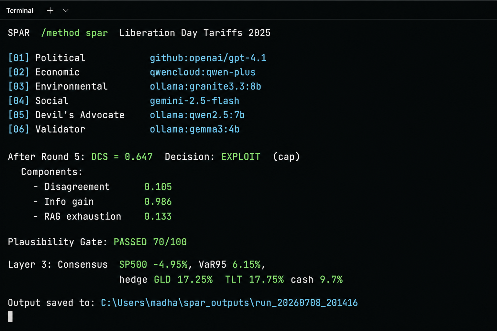
</p>

<p align="center">
  <strong>Scenario Planning via Agentic Reasoning</strong><br>
  Multi-LLM debate for geopolitical financial stress testing.
</p>

<p align="center">
  Five specialist models debate a shock. A separate validator synthesises consensus and dissent.
  A factor model turns that into sector P&amp;L, VaR, and a hedge overlay.
</p>

<p align="center">
  <a href="LICENSE"></a>
  <a href="https://www.python.org/downloads/"></a>
  
  
</p>

**SP Jain School of Global Management — AI in Finance — Group 3 — Dr. Guha**  
Course submission, 2026. Authors: [AUTHORS.md](AUTHORS.md). Cite: [CITATION.cff](CITATION.cff).

This codebase started as a fork of [Quorum](https://github.com/Detrol/quorum-cli) (terminal multi-model debate). It has been rebuilt around **SPAR**: channel-first Layer 0 evidence, live sequential debate, DCS explore/exploit, plausibility gating, and Layer 3 portfolio quantification. Upstream credit: [NOTICE.md](NOTICE.md).

---

## Why SPAR exists

Single-prompt “what happens to markets?” answers are brittle. SPAR forces **structured disagreement** across domains, then scores whether the debate should continue, whether the scenario is plausible, and what a $10M book should do.

| Layer | What it does |
|-------|----------------|
| **0** | Shock profiler + transmission-channel evidence (not analogue-first matching) |
| **1** | Five agents debate: Political, Economic, Environmental/Tech, Social, Devil's Advocate |
| **1b** | **DCS** (Debate Continuation Score) chooses EXPLORE vs EXPLOIT |
| **2** | Fresh-session validator → consensus JSON, minority dissent, plausibility gate |
| **3** | Pure Python factor model → heatmap, VaR, ES, GLD/TLT hedge, portfolio P&amp;L |

**Research question:** does *model* diversity (Approach B) beat *persona* diversity on one model (Approach A), on top of the same debate structure?

---

## How the system connects

Eraser-style maps of layers, model speak-order, the DCS loop, and the path from a shock to a $10M hedge. Source files you can paste into [eraser.io](https://eraser.io) live in [`docs/diagrams/`](docs/diagrams/).

<p align="center">
  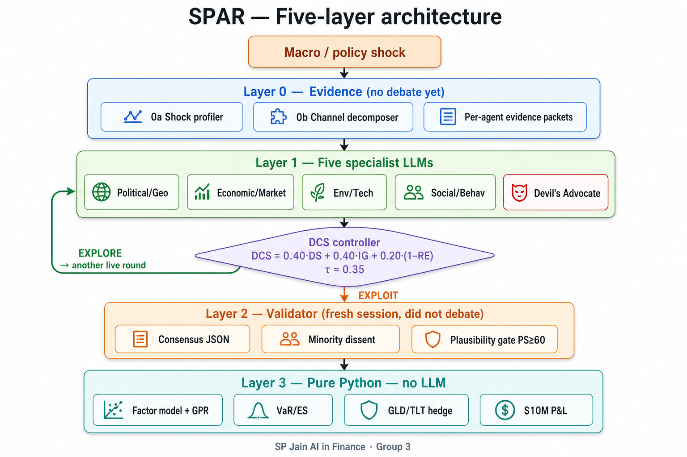
</p>

<p align="center"><em>Layers 0→3. DCS either sends agents back into another live round (EXPLORE) or hands the transcript to a validator that never debated (EXPLOIT).</em></p>

<p align="center">
  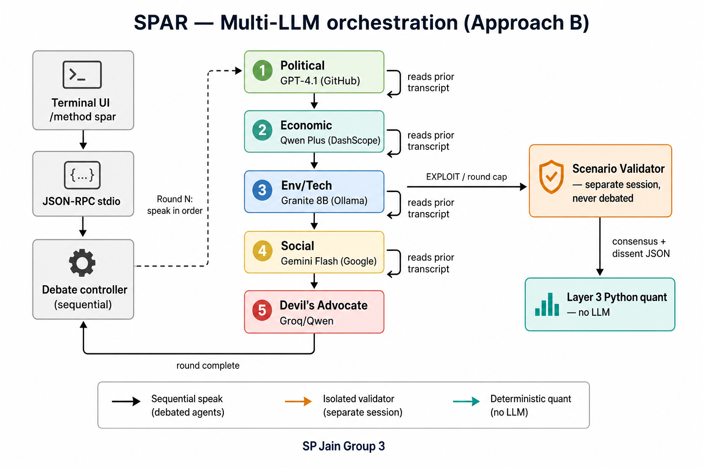
</p>

<p align="center"><em>Approach B: each specialist is a different provider. They speak sequentially and read the growing transcript. The validator is a fresh session.</em></p>

<p align="center">
  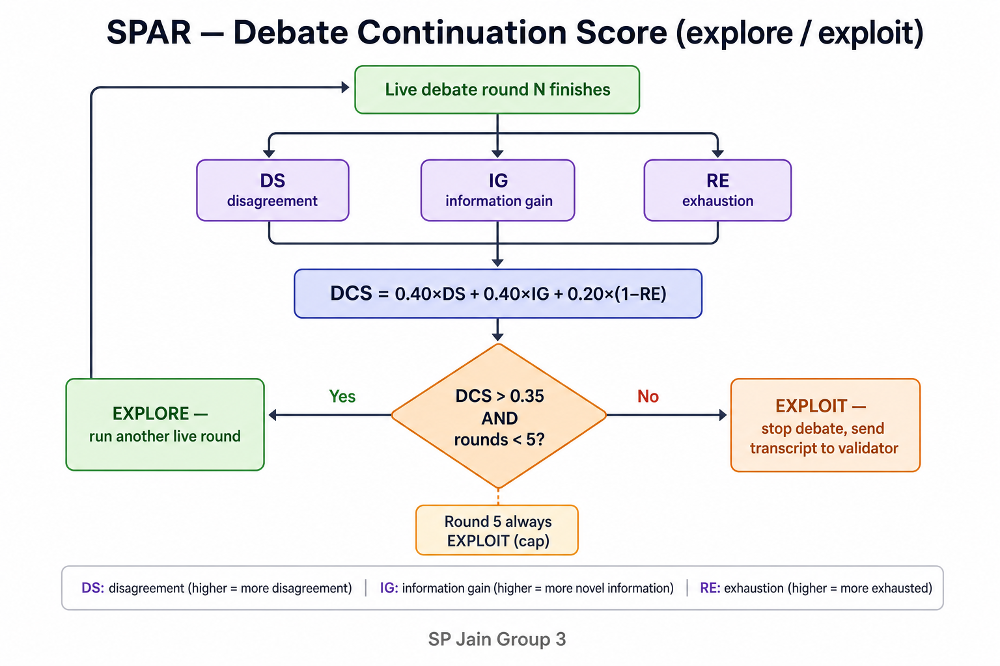
</p>

<p align="center"><em>After each live round: DCS = 0.40·DS + 0.40·IG + 0.20·(1−RE). Continue if DCS &gt; 0.35 and rounds &lt; 5.</em></p>

<p align="center">
  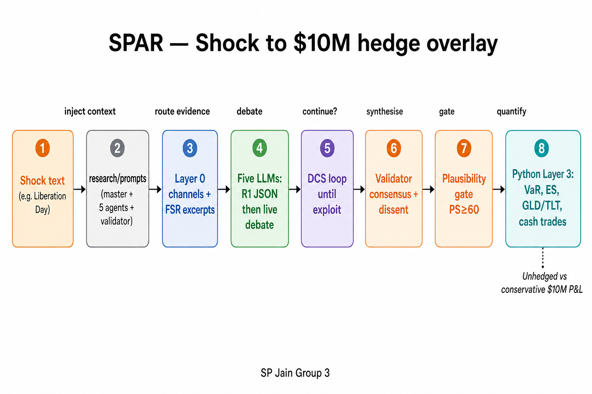
</p>

<p align="center"><em>End-to-end dependency: prompts and Layer 0 evidence feed the debate; the gate must pass before Layer 3 (no LLM) sizes VaR and hedges.</em></p>

<p align="center">
  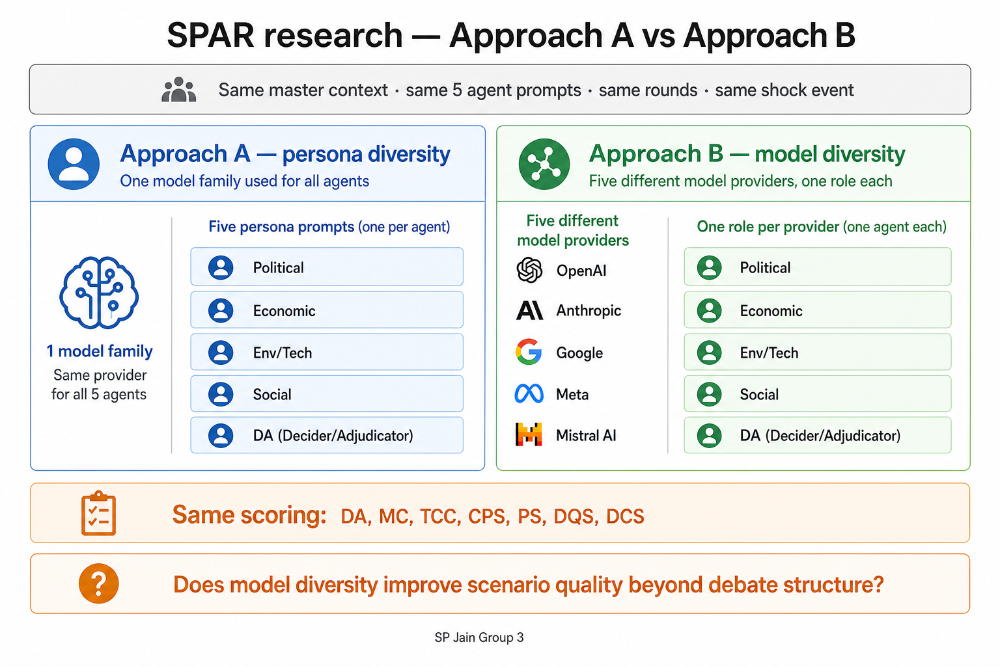
</p>

<p align="center"><em>Same structure, different diversity: personas on one model (A) vs five providers (B). Same scoring board.</em></p>

---

## Sample outputs (offline pilot)

Charts from `research/sample_outputs/offline_pilot/`:

<p align="center">
  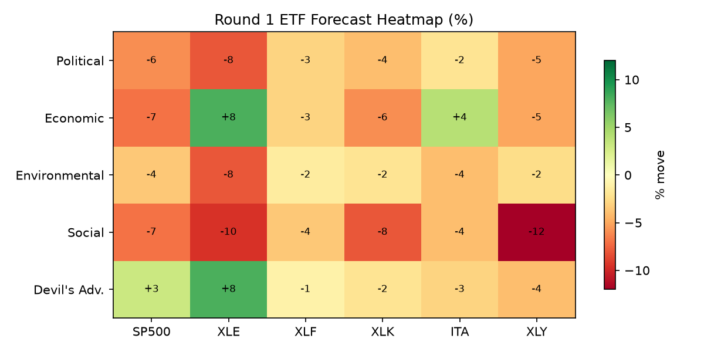
</p>

<p align="center">
  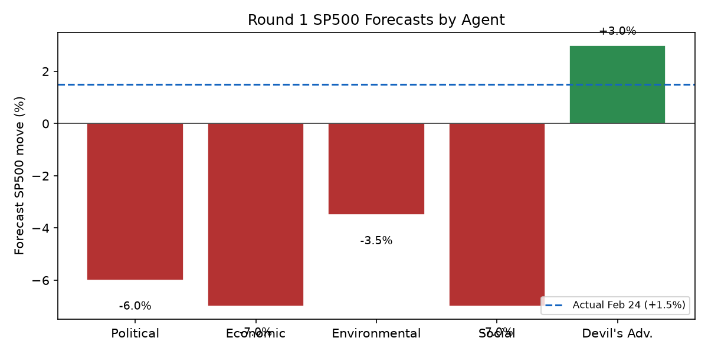
</p>

<p align="center">
  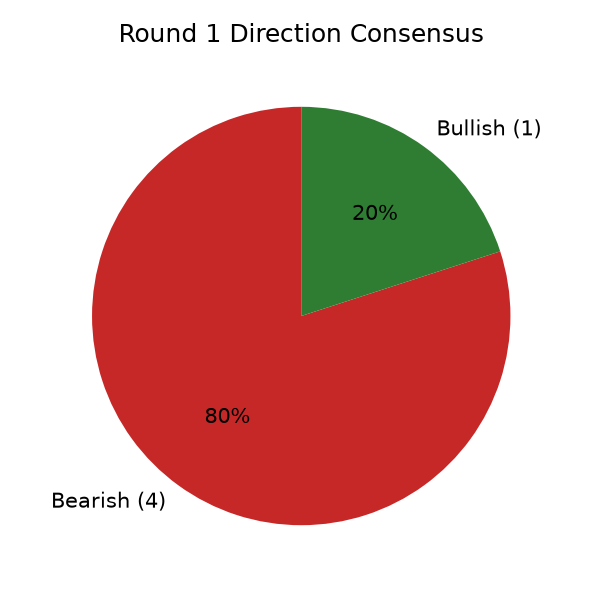
  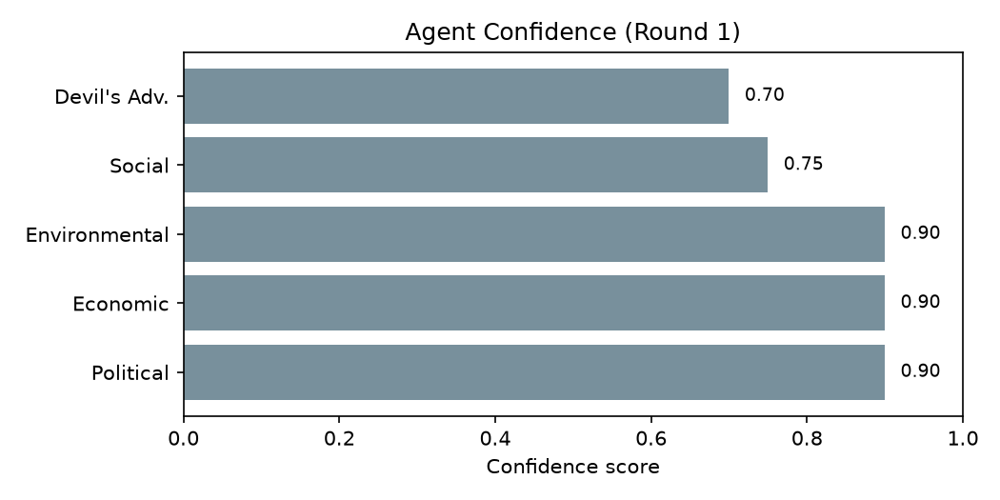
</p>

Full architecture HTML: [research/SPAR.html](research/SPAR.html) · prompts: [research/spar-prompts.html](research/spar-prompts.html) · dashboard: [research/spar-overhaul-dashboard.html](research/spar-overhaul-dashboard.html)

---

## Quick start

**Requirements:** Python 3.11+, Node.js 18+, optional [Ollama](https://ollama.com) for local models.

### Windows

```cmd
install.bat
copy .env.example .env
notepad .env
spar.bat
```

### Linux / macOS

```bash
./install.sh
cp .env.example .env
nano .env
./spar
```

In the terminal UI:

```
/method spar
```

Select **six** models (five specialists + validator), then paste a shock. Liberation Day example:

```
On April 2, 2025, the United States announced broad reciprocal tariffs under the
"Liberation Day" trade policy package, with sector-specific rates on imports from
major trading partners and immediate implementation timelines. Equity futures fell
sharply overnight; the VIX rose; USD strengthened; bond yields moved lower on
growth concerns. Knowledge cutoff: April 2, 2025, 09:00 ET (before cash equity open).
```

`quorum.bat` / `./quorum` still launch the same UI (engine package name).

---

## How a SPAR run works

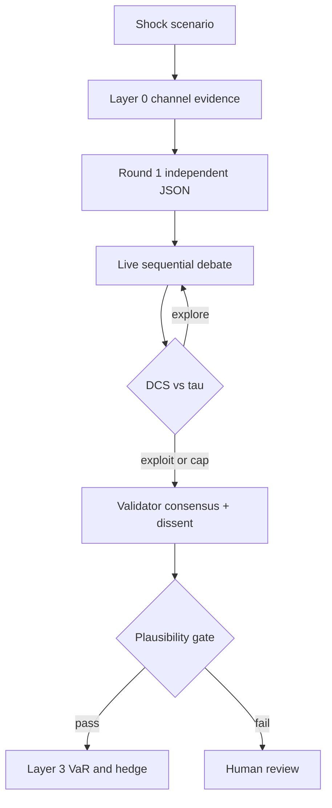

**DCS (paper form):** `DCS = 0.40×DS + 0.40×IG + 0.20×(1−RE)`  
The current prototype uses a close operational proxy (see `src/quorum/methods/spar_dcs.py`). Threshold τ = 0.35, max 5 live rounds.

**Plausibility:** moderator score blended with Fed FSR alignment (`config/spar_fsr_benchmark.json`). Gate τ = 60.

---

## Repository layout

```
.github/            CI, code of conduct, security policy
config/             SPAR model presets, FSR excerpts, Layer 3 factors
docs/               Overhaul notes, ADRs, API protocol, demo.gif
examples/           Offline Ollama pilot + cloud API brief test
frontend/           Terminal UI (Ink / React)
research/           Prompts, research HTML, sample run
scripts/            Report generators
src/quorum/         Runtime engine (package name kept for compatibility)
tests/              SPAR, DCS, providers, IPC tests
```

| Path | Role |
|------|------|
| [research/prompts/](research/prompts/) | Master context + 5 agents + validator |
| [research/README.md](research/README.md) | Research file index |
| [docs/SPAR_Offline_Workflow_And_Changes.md](docs/SPAR_Offline_Workflow_And_Changes.md) | What changed vs original Quorum |
| [docs/SPAR_Research_Implementation_Checklist.md](docs/SPAR_Research_Implementation_Checklist.md) | Implementation checklist |
| [SUBMISSION.md](SUBMISSION.md) | What to hand in to the course |
| [NOTICE.md](NOTICE.md) | Upstream Quorum attribution |

New live artifacts write to `research/spar_outputs/` (gitignored) or `QUORUM_REPORT_DIR`.

---

## Configuration

Copy `.env.example` → `.env`. **Never commit keys.**

```env
QUORUM_EXECUTION_MODE=sequential
QUORUM_MODEL_TIMEOUT=180
QUORUM_REPORT_DIR=~/spar_outputs
OLLAMA_BASE_URL=http://localhost:11434
```

| File | Use |
|------|-----|
| [`.env.spar-offline.example`](.env.spar-offline.example) | Local Ollama stack |
| [`.env.spar-free.example`](.env.spar-free.example) | Hybrid cloud + Granite |
| [`config/spar_offline_models.json`](config/spar_offline_models.json) | Offline role map |
| [`config/spar_cloud_models.json`](config/spar_cloud_models.json) | Cloud / hybrid presets |

---

## Other debate methods

The original engine still supports: Standard, Socratic, Advocate, Oxford, Delphi, Trade-off, Brainstorm. SPAR is the research method (`/method spar`).

---

## Reproduce

See **[docs/REPRODUCE.md](docs/REPRODUCE.md)** for install, offline smoke, cloud brief test, and the files in `research/sample_outputs/`.

Thin extract of the July 2026 Liberation Day hybrid UI run: [`research/sample_outputs/liberation_day_hybrid/`](research/sample_outputs/liberation_day_hybrid/).

---

## Limitations

Be explicit about these in the paper and in Q&amp;A:

- **DCS implementation ≠ paper formula.** Code weights are `0.34 / 0.33 / 0.33`. Disagreement is frozen from Round 1 SP500 JSON; information gain is transcript token novelty; exhaustion is 3-gram repetition — not spaCy JSON diffs or Jaccard on retrieved doc IDs. That is why DCS can stay ~0.65 after forecasts have already clustered.
- **Magnitude calibration can be 0** on crash events. Liberation Day hybrid consensus was about −5% SPX vs actual 3-day −10.53%. Direction was mostly right; size was not. SPAR is stronger as a **scenario and hedge engine** than as a point-forecast of tail depth.
- **Validator JSON vs live debate.** Some agents (notably Granite in later rounds) emit prose, not schema, so sector fields and confidence can be missing even when the argument is usable.
- **Hero image** is a reconstructed terminal view of run `run_20260708_201416`. The original Quorum demo GIF remains at `docs/demo.gif`.
- **Python package** is still `quorum` internally so the UI and tests keep working.

---

## Cite

```bibtex
@software{spar2026,
  title  = {SPAR: Scenario Planning via Agentic Reasoning},
  author = {Vij, Madhavan and {SP Jain School of Global Management, AI in Finance Group 3}},
  year   = {2026},
  url    = {https://github.com/GoldnDarkns/spar-cli}
}
```

GitHub also offers **Cite this repository** from [CITATION.cff](CITATION.cff).

---

## Tests and pilots

```bash
uv run pytest
uv run python examples/spar_ollama_pilot.py --help
uv run python examples/spar_cloud_brief_test.py --list-providers
```

---

## Course documents

| Document | Location |
|----------|----------|
| Architecture + DCS math | [research/SPAR.html](research/SPAR.html) |
| Presentation | [research/spar-presentation.html](research/spar-presentation.html) |
| Prompt specs | [research/spar-prompts.html](research/spar-prompts.html) |
| Research proposal | [research/SPAR_Research_Proposal.docx](research/SPAR_Research_Proposal.docx) |
| Reproduce a run | [docs/REPRODUCE.md](docs/REPRODUCE.md) |
| SPAR changelog | [CHANGELOG.md](CHANGELOG.md) |
| Overhaul write-up | [docs/SPAR_Overhaul_And_Updates.pdf](docs/SPAR_Overhaul_And_Updates.pdf) |

---

## License

Original Quorum engine: **Business Source License 1.1** (Andreas Thun / Detrol) — see [LICENSE](LICENSE).  
SPAR research layers, prompts, and Group 3 documents are academic course work. See [NOTICE.md](NOTICE.md).
